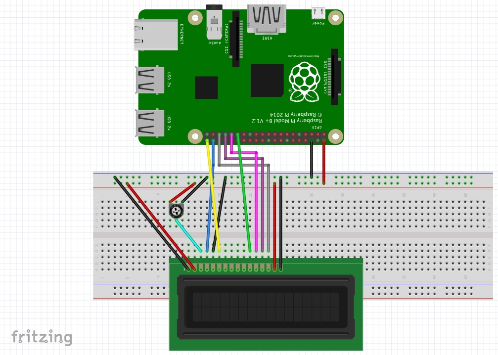

# nodejs-pi-lcd
Node.js example code and wiring diagram for using a Hitachi HD44780-based LCD with the Raspberry Pi B+ or A+. This example displays the current time and updates every second.

### Wiring

### Displays
Any HD44780-based display should work. I've tested this code with the following displays:
* [16x2 White on Blue LCD Module](http://amzn.to/1HFaPds)
* [20x4 White on Blue LCD Module](http://amzn.to/1I31uio)
